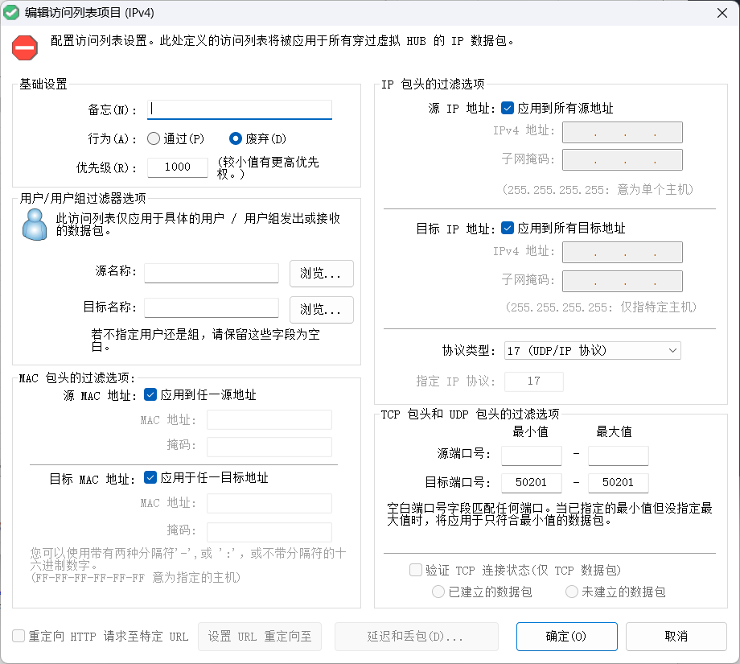

# CHUNITHM HDD 店内联机指北

本文首先介绍 chunithm 店内联机的基本原理，总结当前运行 hdd 实现联机的若干种方案，提出一定改进，并在最后介绍一种我们正在使用的全新联机方案，该方案无需安装其他软件，不需要频繁修改配置，也不需要自建服务器，并且可以获得相当不错的稳定性。

## 基本原理

### 网络环境

AM Daemon 对网络环境要求极为严苛，所以一般都会通过 segatools 配置虚拟局域网环境（通过 `netenv` 和 `keychip.subnet`）。但是实际上并没有创建一个真正的虚拟网络，只是把 `GetAdaptersAddresses` `GetIfTable` `GetBestRoute` 等与物理设备和路由有关的 WinAPI 调用 hook 掉了，让游戏认为网络环境符合条件，网络请求仍直接通过真实的接口正常进行（唯一的例外是 ICMPv4 Echo）。为了实现联机，仍然需要一个真正的局域网，并通过设置 `netenv` 让游戏在指定的这个网络上通信。

正常游玩不需要配置特殊的网段，但是要店内联机时，需要子网为 `192.168.139.0/24`。接下来的教程里，将使用各种方法获得满足条件的网络接口。在这里先讲解通用的配置方法：

假设一个玩家获得了 `192.168.139.xxx` 的地址，则他需要修改 `segatools.ini` 的如下内容：

```ini{3,7} [segatools.ini]
[netenv]
enable=1
addrSuffix=xxx

[keychip]
enable=1
subnet=192.168.139.0
```

### 网络通信

游戏在局域网中会发生以下三类通信：（端口号以新框为准，旧框有略微不同）

- 配信：配信服务器（配信サーバー）向 `255.255.255.255:40112` 发送 UDP 广播。如果局域网内没有配信服务器或有多个配信服务器都无法启动（*但是实际上的情况是，多个配信服务器触发冲突检测的概率不大，而客户端却很容易经常找不到服务器。一般认为可以把所有机台都设置成配信服务器，如果出现 8406 错误可以反复进入 test 菜单重试几次*）。配置项为 `segatools.ini` 中的 `system.dipsw1`（较新版本的 segatools 应当支持直接在此处配置，旧一些的版本可能需要修改 `config_xxx.json`，这里不再介绍）。
- 基准机（基準機）：基准机向 `192.168.139.255:50201` 发送 UDP 广播，其他机台与基准机建立 TCP 连接获取配置数据并进行心跳检查。同样的，如果没有基准机或者有多个基准机也是无法正常启动的（与配信服务器的非强制要求不同，基准机必须严格设置）。配置项为 游戏 Test 菜单（ゲームテストメニュー） - 游戏设定（ゲーム設定） - 组内基准机设定（グループ内基準機設定）。
- 店内匹配（店内マッチング）：开启匹配的主机向 `192.168.139.255:50200` 发送 UDP 广播，收到的机台如果满足条件（如分组一致等）则会在店内匹配中显示募集信息，其他机台加入联机时会与主机建立 TCP 连接。

实际上只有第三类通信是需要的。前两类通信在街机厅环境里不是问题，但是对于 HDD 玩家来说，每次进行联机时参与的设备都可能不同，中途也可能会发生退出和新成员加入，很难特定一名玩家或设备作为唯一的配信服务器和基准机，这就导致目前的大部分联机方案都需要反复修改配置，十分不方便。

有以下两种办法可以避免繁复配置基准机：

:::=tabs
::屏蔽端口
我们在实际操作中发现，基准机配置和店内联机是独立的。即：
1. 基准机设置只影响进入游戏标题前的自检，只要进入标题，把基准机关掉都没问题
2. 店内联机的广播数据包是房主产生并发送的，即使各机台并没有连接至同一基准机，也能够联机

于是很自然地想到，可以在局域网内屏蔽基准机广播的端口 `50201`，隔离各个机台。这样的话所有游戏机台都设置成基准机即可。*最好把 `40112` 顺便也屏蔽了。*

当然也可以只让目的为 `50200` 端口的流量通过。

**优点**：
- 游戏配置简单，单机或联机游玩不需要切换不同的配置

**缺点**：
- 网络配置复杂，需要手动设置访问控制规则或者防火墙规则（但是一劳永逸）

有一个通用的方法是设置 Windows 防火墙规则，但是较为繁琐，这里不再详细介绍。建议是把入站和出站都屏蔽掉。下面的各种方案会介绍各自的屏蔽方法。

::虚拟基准机

用一个独立的程序伪装成基准机，与局域网内其他设备进行各项通信。这样的话所有游戏机台都设置成跟随基准机即可。

**优点**：
- 配置简单

**缺点**：
- 需要在网络中有一台单独的机器运行虚拟基准机服务，不能在运行游戏的设备上同时运行虚拟基准机
- 如果虚拟基准机下线，则其他所有机台都无法启动游戏

公开的支持新框的方案（欢迎补充）：
- https://bemani.cc/d/245-chunithmongeki/10 （闭源）

支持旧框的方案：
- https://github.com/harusame3144/chuni-virtual-base-server （开源）

*笔者并不打算再重写一个新的开源的虚拟基准机实现，因为这种方案局限性很大。*
:::


## 调试工具

在开始介绍各种方案之前，首先介绍一下我们最新开发的联机网络调试工具：[chuni-c2c-dumper](https://github.com/AsakuraMizu/chuni-c2c-dumper)。该工具通过 pcap 捕获局域网中所有联机招募的数据包（即目的端口号为 50200 的 UDP 广播）并解密。如下图所示：


具体使用方法请参照上面的链接。

## 各种方案介绍

### 物理局域网

最简单暴力的方案，但是前提是联机的设备需要在同一个有限的物理空间内。操作也很简单，各个设备连接到同一个物理网络，自动或手动分配满足条件的地址即可。

笔者尝试过的两台电脑直接拉网线的方案：  


仅作展示。

### ShadowTenpo

- 发布帖：https://bemani.cc/d/258-segavpn-aka-chunithm
- 项目地址：https://dev.s-ul.net/ilufang/shadowtenpo

::: warning
ShadowTenpo 已停止维护，最后提交于 2022 年 2 月，功能也并不完善，请谨慎使用。虽然有其他开发者继续维护的后续版本，但是目前并未公开。
:::

ShadowTenpo 是 [ilufang](https://space.bilibili.com/3923562) 为 CHUNITHM 店内联机开发的**专用**软件。具体的教程看原帖就差不多了，注意一下给新框用需要把设置里的端口号 `50000` 改成 `50200`。这里简单讲一下原理和这个方案的问题。

相比后面的方案所使用的 VPN 软件提供的一整套虚拟网络，ShadowTenpo 只提供一个“阉割版”：只监听并转发店内联机用的端口，IP 地址也只使用 `192.168.139.11` 到 `192.168.139.14` 这四个。一个玩家选用其中的一个地址后，ShadowTenpo 会在其余三个地址上各起一个 UDP 套接字和一个 TCP 套接字并监听店内联机的端口，通过在其他玩家对应的地址上与本机玩家的地址进行通信的方式完成转发。

**优点**：
- 绿色软件，删除即卸载
- 几乎完全纯净（除了添加四个临时的虚拟地址，而这一步甚至也是用户运行脚本手动完成的），无副作用（只转发店内联机的数据包）

**缺点**：
- 仅有 4 个地址可用
- 不支持静态分配地址，尽管可以通过 `pref_ip` 获取*相对*稳定的地址，但是毕竟只有 4 个，人一多就完蛋
- 需要具有公网 IP 的设备作为中转服务器
- 配置较困难，Node.js 编写且没有提供打包，需要安装工具链才能使用

现在看来，这一方案还远不够成熟，这也是把这种方案放在各种 VPN 方案之前介绍的原因，尽管该方案是为了取代 VPN 方案开发出来的。有趣的是，笔者研究店内联机的出发点正是想要重写并改进 ShadowTenpo，结果随着开发过程中的逐渐改进，最终还是改成了 VPN。感兴趣的读者可以在 [AsakuraMizu/minitier](https://github.com/AsakuraMizu/minitier) 看到它的代码。

::: details 改进思路
- 部署不方便，功能有限 -> RIIR(?)
- 可用地址太少 -> 增加地址个数
- 监听许多地址开销太大 -> 直接在网络设备上捕获和注入(pcap)
- 手动配置地址不方便 -> 自动管理虚拟网卡(TUN/TAP)

然后就成功地把它改造成了 VPN。
:::

### SoftEther VPN

基础教程请参考 https://two-torial.xyz/extras/softether/

**优点**：
- 功能强大
- 不需要公网 IP，SoftEther 提供了动态 DNS 和 NAT 穿透功能（未测试）

**缺点**：
- 仍然需要一台固定的机器作为服务端运行
- 对于联机这种简单的需求来说功能有些过于强大了...界面也过于复杂，非专业人士可能难以弄明白各种功能

:::tip 补充
- 图形界面服务器管理工具只支持 Windows 和 MacOS，但是管理工具可以连接远程服务器进行配置；实在没办法通过图形界面配置也可以使用 `vpncmd` 在命令行中管理
- 在“管理访问列表”中可以添加端口屏蔽的规则，例如下面的配置会过滤掉目的端口为 `50201` 的 UDP 数据包：
  
:::

### ZeroTier

ZeroTier 几乎可以说是目前市场上最流行的 VPN 解决方案，配置不是很复杂，自由度也较高。这里只介绍通过官方服务器进行配置的方案，如果想要自建服务器请自行搜索如何自建 moon 或 planet。

1. 登录[管理面板](https://my.zerotier.com/)
2. 创建网络
3. 配置路由：在“Advanced”中，找到“Managed Routes”，删除原有的配置，并添加 `192.168.139.0/24`（无特殊需求可以不用填写 “Via”）
   
4. （可选）自动分配地址：在下面的“IPv4 Auto-Assign”中，切换到“Advanced”选项卡，删除原有的地址段，添加 `192.168.139.1`-`192.168.139.254`
   
   当然也可以不使用自动分配地址，手动为每个用户分配。
5. 配置规则：找到“Flow Rules”，修改为：
   ```txt{9,10}
   # This is a default rule set that allows IPv4 and IPv6 traffic but otherwise
   # behaves like a standard Ethernet switch:
   drop
   	not ethertype ipv4
   	and not ethertype arp
   	and not ethertype ipv6
   ;
   
   drop ipprotocol udp dport 50201;
   drop ipprotocol udp dport 40112;
   
   # Accept anything else. This is required since default is 'drop':
   accept;
   ```
   其中只有两行高亮的部分是需要添加的，其他是默认就有的。当然你也可以只让店内联机的数据包通过，这样你只需要把规则改成下面的这一行即可：

   ```
   accept dport 50200;
   ```
6. Enjoy

**优点**：
- 成熟的商业产品，可以保证稳定性
- 配置较简单
- 支持客户端 P2P 连接
- 不需要服务器或公网 IP

**缺点**：
- 公共服务器在国内连接性一般，可以自建服务器但是较复杂
- 桌面工具没有控制开关，只能以服务方式使用并随系统开机自动启动，如果需要手动开关连接需要修改 Windows 服务设置，较复杂，对用户计算机有侵入性影响

:::info TailScale?
TailScale 也是一款广泛使用的商业 VPN 解决方案，与 ZeroTier 的对比可以查看[官网的介绍](https://tailscale.com/compare/zerotier)。但是它只能使用 `100.64.0.0/10` 段，所以基本上可以洗洗睡了。而且这个限制是写死在[代码](https://github.com/tailscale/tailscale/blob/68997e0dfac4b78ac2ebaa9ea9f0f075c250aae7/net/tsaddr/tsaddr.go#L34)里的，就算用开源的 `headscale` 自建服务端也无法避免。
:::

:::info 国内软件？
别看了，全都要收钱
:::

## 新方案：EasyTier

[EasyTier](https://easytier.cn/) 是“一个简单、安全、去中心化的内网穿透 SD-WAN 异地组网方案”，简单到它完全工作在用户态，不需要任何的安装，开箱即用，设计上完全去中心化，任何运行 EasyTier 的节点都可以作为中转服务器。并且这个软件是国人开发的，公共服务器也大部分在国内，对国内用户的网络环境非常友好。尽管目前仍在积极开发中，功能还不是很完善，官方 GUI 功能也不是很方便，但是对于中二联机这种简单需求来说已经足够稳定。

唯一的遗憾是它目前还不支持访问控制规则。怎么办？在等待官方支持之前，我们的解决办法是：patch！你可以在[这里](https://github.com/AsakuraMizu/EasyTier/tree/releases/chunithm)看到被笔者魔改后的代码。该 patch 版本仅增加了对目的端口为 `50201` 和 `40112` 的 UDP 数据包的出站过滤，在版本号上添加了 `-chuni` 后缀与官方版本区分。

由于这个软件支持非常多不同的组网方式（有无公网IP、网络接入方式等等），并且[官方文档](https://easytier.cn/)和[社区教程](https://doc.oee.icu/)都很详细，这里不再展开介绍。笔者推荐使用 [EasytierGame](https://github.com/EasyTier/EasytierGame/) 作为图形界面，界面简单好用，支持分享配置（复制配置到剪切板），并且直接在目录下替换 `easytier-core`（和`easytier-cli`）即可替换内核版本。

**优点**：
- 连接稳定，速度快
- 不需要公网 IP 或服务器
- 用户态，免安装，对用户设备无侵入性影响
- 网络连接随时可自由开关，不影响日常使用

**缺点**：
- 软件还不是很成熟
- 没有统一的图形界面
- 配置项较复杂
- 目前依赖于魔改版本，无法保证更新（后续官方版本加入访问控制支持后会更新本教程）

:::tip
1. 理论上讲使用 UDP 连接性能最好
2. NAT4（对称型NAT）较难通过 UDP 穿透，建议使用 TCP；但是一般不影响与公共服务器的连接
3. 因为没有 IP 地址冲突检测，需要连接后自行查看成员列表检查是否有冲突
:::

可以在[这里](https://www.bilibili.com/video/BV1Jh6GYkEue/)看到我们对这个方案进行测试的实录。
